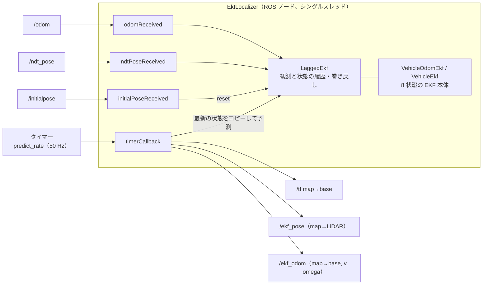
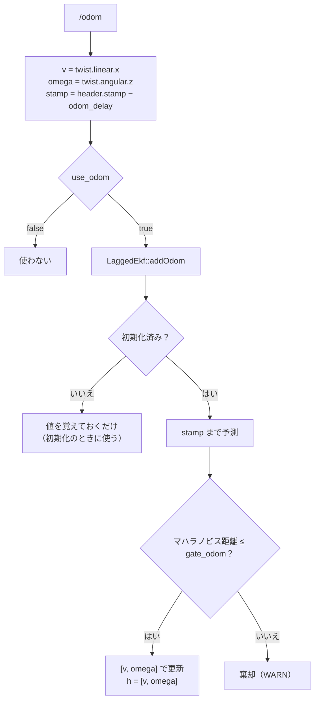
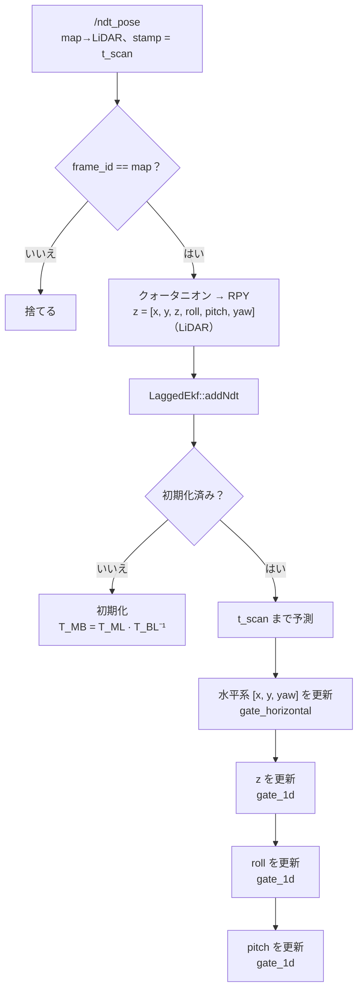
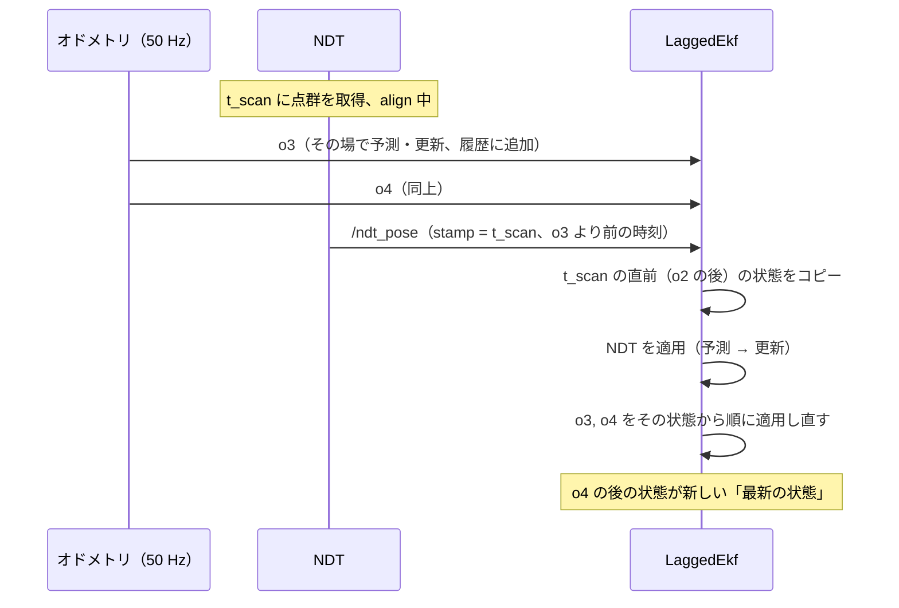
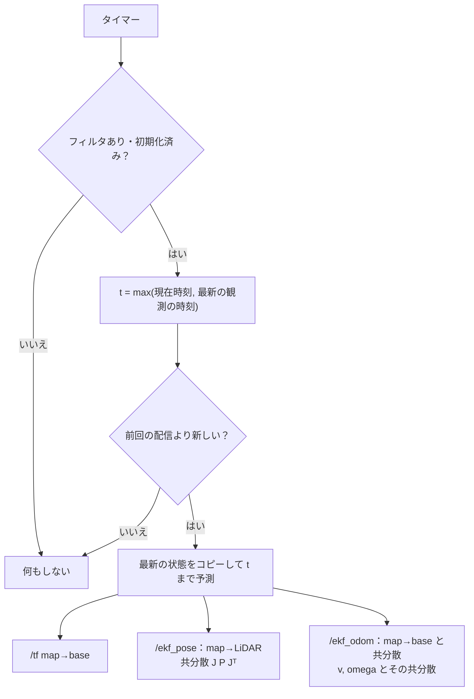

# EKF の処理の流れ

`ekf_localizer` が NDT の解とオドメトリから車両の姿勢を推定する流れです。

## 構成

| クラス | ファイル | 役割 |
|---|---|---|
| `EkfLocalizer` | `src/ekf_localizer_node.cpp` | 購読・配信・タイマー。ROS とのやりとり |
| `LaggedEkf` | `src/lagged_ekf.cpp` | 観測を時刻順に保持し、遅れて届いた観測を正しい位置に入れ直す |
| `VehicleEkf` | `src/vehicle_ekf.cpp` | EKF 本体（予測と、NDT の観測による更新） |
| `VehicleOdomEkf` | `src/vehicle_odom_ekf.cpp` | `VehicleEkf` にオドメトリの観測を加えたもの（`use_odom: true`） |

コールバックは 1 つずつ順に実行されます（シングルスレッド）。1 回の処理は最も重い場合でも 0.3 ms 未満で、50 Hz の周期に対して十分に軽い処理です。

## 状態

| 添字 | 状態 | 単位 | 座標系 |
|---|---|---|---|
| 0–2 | x, y, z | m | map 座標での base の位置 |
| 3–5 | roll, pitch, yaw | rad | map 座標での base の姿勢（ZYX） |
| 6 | v | m/s | base の前進速度 |
| 7 | omega | rad/s | ヨー角速度 |

base は `base_frame_id` です（Gazebo：`base_footprint`、実機：`base_link`）。
NDT が出すのは LiDAR の姿勢なので、base と LiDAR の間を取付 T_BL で変換します。T_BL は起動時に TF（base → `lidar_frame_id`）から読みます。

## 1. 起動

1. パラメータを読む（`param/ekf.yaml`）。
2. タイマーのたびに、TF から取付 base → LiDAR を引く。取れるまでは `Waiting for TF ...` を出して待つ。
3. 取付が取れたらフィルタを作る（`use_odom` が true なら `VehicleOdomEkf`、false なら `VehicleEkf`）。この時点では**未初期化**で、何も配信しない。

取付は起動時に 1 回しか読みません。静的 TF を変えたら、EKF も起動し直してください。

## 2. 観測を受け取ったとき

どちらの観測も、`header.stamp` の時刻の位置に `LaggedEkf` へ挿入します（3 章）。挿入した位置で次の処理を行います。

### オドメトリ（`odomReceived`）

- 観測ノイズは `R_odom` です。`odom_covariance_source: "message"` のときは `twist.covariance[0]`・`[35]` を使い、値が正でなければ `R_odom` に戻します。
- twist は車体座標なので、v・omega は状態の値と直接対応します（座標変換は不要）。
- **遅れ（`odom_delay`）**：twist が実際の動きより遅れる分を stamp から引いて、正しい時刻の位置に入れます。
  Gazebo の diff_drive_controller は twist を 10 サンプル（50 Hz で 0.2 s）の移動平均で出すので、真値と比べて
  v・omega とも 0.09〜0.10 s 遅れます（Gazebo では `odom_delay: 0.09`）。遅れたまま入れると、旋回の開始・反転・停止で
  yaw が 5〜10° ずれます。
- **滑り**：その場旋回では車輪が滑り、オドメトリの omega が真値の約 1.09 倍になります（Gazebo）。
  これは補正せず、白色ノイズとして扱います。50 Hz で入るオドメトリに yaw が引っ張られるので、yaw の `Q` を
  小さくしすぎると NDT がゲートで棄却されて破綻します（既知の制限）。

### NDT の解（`ndtPoseReceived`）

- 観測ノイズは `R_ndt` です。`/ndt_pose` の共分散は使いません。
- **観測モデル**：h(x) = T_MB(x) · T_BL。状態から予測した LiDAR の姿勢を NDT の解と比べます。ヤコビアンは h の中心差分で求めます。取付位置のずれ（レバーアーム）があるため、車両が傾いたり回転したりすると LiDAR の位置も動きますが、それも含めて厳密に扱えます。
- **初期化**：最初の NDT の解から車両の姿勢を求めます。`use_odom: true` では、`t_scan` から `odom_timeout_init`（0.2 秒）以内のオドメトリがあれば、v・omega もその値から始めます（`EKF initialized from odometry`）。なければ 0 から始めます。
- **更新の順序とゲート**

| 段 | 対象 | ゲート（既定） | 棄却が続いたとき |
|---|---|---|---|
| 1 | [x, y, yaw] をまとめて | `gate_horizontal` 11.34（χ²(3)、99%） | 何もしない（WARN だけ）。間違って収束した NDT の解に飛び移らないため |
| 2 | z | `gate_1d` 6.63（χ²(1)、99%） | `lockout_count`（10）回続いたら、z だけを観測値に合わせて再初期化 |
| 3 | roll | 同上 | 同上 |
| 4 | pitch | 同上 | 同上 |

  各段は独立に判定します（水平系が棄却されても z・roll・pitch は更新されます）。共分散の更新には Joseph 形を使います。

## 3. 巻き戻しと再計算（`LaggedEkf`）

観測を 1 つ処理するたびに、**その観測と、処理した直後の状態の組**を時刻順に保存します。

- 同じ時刻の観測が複数あるときは、届いた順に並べます。
- 順番が入れ替わって届いたオドメトリも、同じ仕組みで正しい位置に入ります。
- **履歴の整理**：最新の観測から `history_length`（1.0 秒）より古い観測を捨てます。捨てた中で最も新しい状態を「起点」として残します。
- **古すぎる観測**：起点より古い時刻の観測は捨てて WARN を出します（`... older than the history`）。NDT の遅れより `history_length` を長くしてください。
- 遅れて届いた観測を入れ直した結果が、時刻順に処理した結果と一致することは、単体テスト `test/test_lagged_ekf.cpp` で確認しています。

## 4. 予測（運動モデル）

`VehicleEkf::propagate`、`VehicleEkf::predictTo`

| 状態 | 予測 |
|---|---|
| x, y | v cos(pitch) で水平に進む。omega による円弧として厳密に積分 |
| z | −v sin(pitch) dt（坂を上り下りする分） |
| yaw | yaw + omega dt |
| roll, pitch, v, omega | 変わらない（ランダムウォーク） |

- 共分散：P = F P Fᵀ + diag(`Q`) · dt。`Q` は単位時間あたりの分散（スペクトル密度）です。
- **`Q` の v・omega は「速度がどれだけ急に変わりうるか」を表します。** 実際の加速より小さいと、オドメトリや NDT が予測と食い違ってゲートで棄却され、破綻します。Gazebo での急旋回（角加速度 約 6.6 rad/s²）で、omega = 0.1 では足りませんでした。
- 1 回の予測で進める時間は最大 `max_predict_dt`（0.2 秒）です。これを超える間隔では、0.2 秒分だけ動かして時刻は最後まで進めます。
  観測が届いている間（オドメトリ 50 Hz、NDT 約 10 Hz）は効きません。観測が途切れたときに大きく外挿しないための上限です。

## 5. 配信（`timerCallback`、`predict_rate`）

- 予測は**コピーに対してだけ**行います。フィルタ本体は観測でしか進めないので、後で巻き戻して計算し直しても食い違いが出ません。
- 3 つの出力は、同じ状態・同じ stamp です。
- 一度配信した値は、巻き戻しで計算し直しても書き換わりません。

## 6. `/initialpose` を受け取ったとき

1. フィルタをリセットし、履歴を消す（直近のオドメトリだけは残し、次の初期化で使う）。
2. 次の NDT の解で初期化し直す。それまでは何も配信しない。

## 時刻

すべての観測は `header.stamp` で時刻順に並べるので、観測の時刻が同じ時計で測られていることが前提です。

| 環境 | 時計 | 点群の stamp | オドメトリの stamp |
|---|---|---|---|
| Gazebo | sim time（`/clock`） | Gazebo が付けた値をそのまま使う | Gazebo が付けた値をそのまま使う |
| 実機 | この PC の時計 | この PC の時計に直してから入れる | この PC の受信時刻 |

## パラメータ

[README.md](../README.md#パラメータ) を参照してください。

## 既知の制限

- **オドメトリと NDT の水平系には、棄却が続いたときに回復する仕組みがありません。** `Q` が実際の動きに対して小さいと、棄却が続いたまま戻らなくなります（z、roll、pitch には `lockout_count` による再初期化があります）。
  オドメトリの遅れ（`odom_delay`）を補っていないときや、車輪の滑りが大きいときに、yaw の `Q` を小さくするとこの状態になります。
- 旋回の反転のように omega が段差で変わる瞬間は、オドメトリに現れるまで（移動平均で約 0.1 s）予測が追いつかず、
  その間だけ yaw が数度ずれます（Gazebo の反転で約 5°、0.15 s）。
