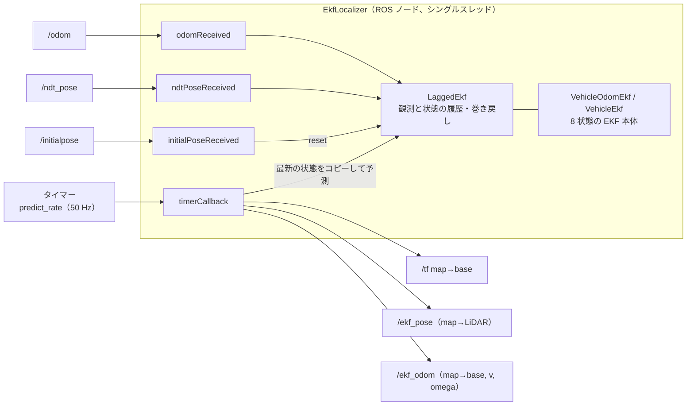
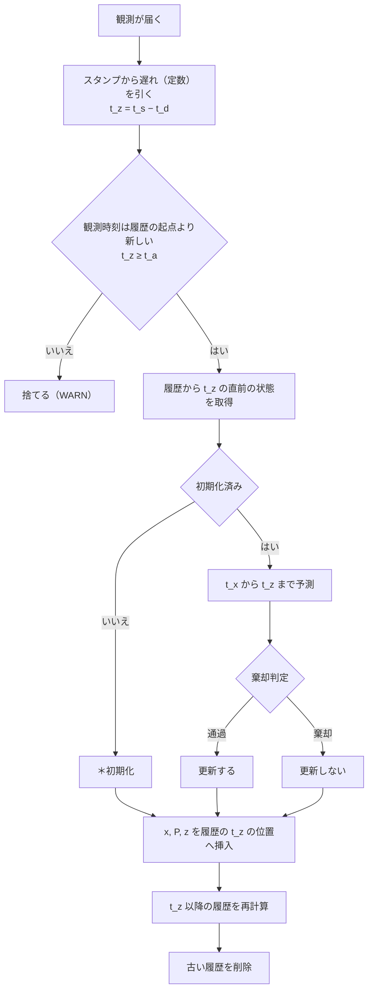
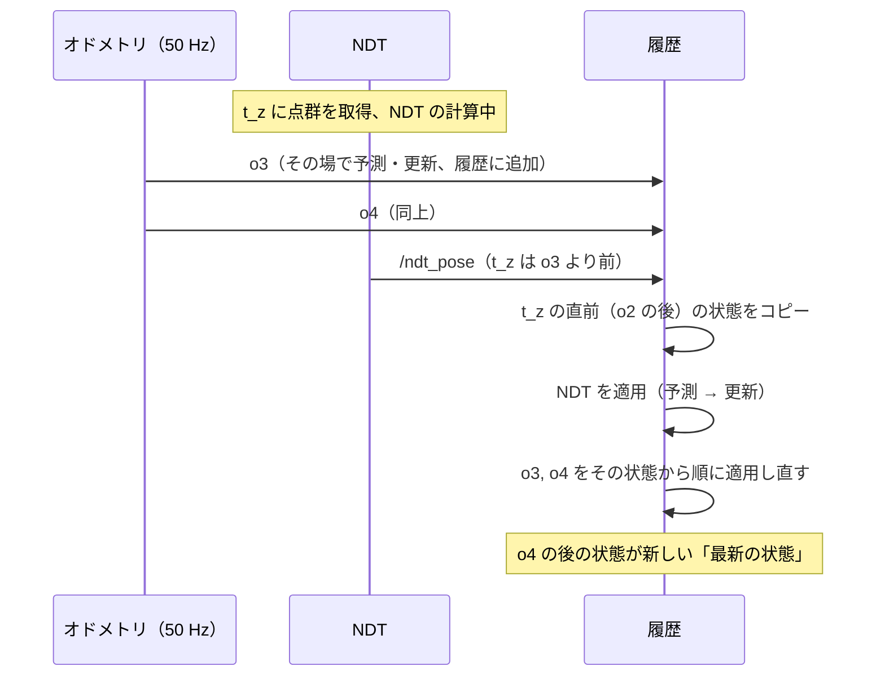
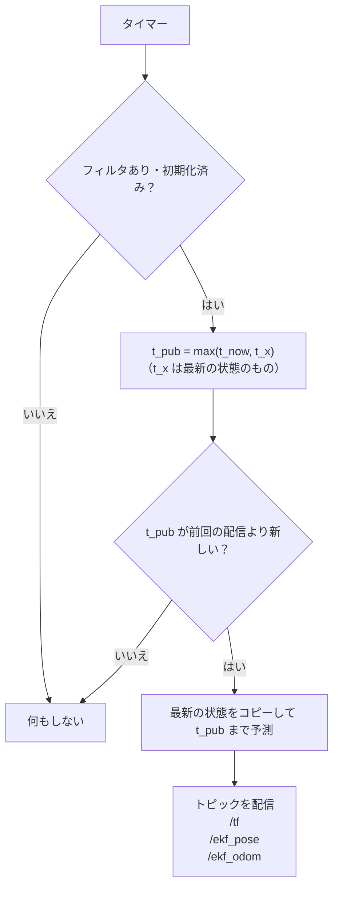

# EKF の処理の流れ

`ekf_localizer` が NDT の解とオドメトリから車両の姿勢を推定する流れです。

## 構成

| クラス | ファイル | 役割 |
|---|---|---|
| `EkfLocalizer` | `src/ekf_localizer_node.cpp` | 購読・配信・タイマー。ROS とのやりとり |
| `LaggedEkf` | `src/lagged_ekf.cpp` | 観測を時刻順に保持し、遅れて届いた観測を正しい位置に入れ直す |
| `VehicleEkf` | `src/vehicle_ekf.cpp` | EKF 本体（予測と、NDT の観測による更新） |
| `VehicleOdomEkf` | `src/vehicle_odom_ekf.cpp` | `VehicleEkf` にオドメトリの観測を加えたもの（`use_odom: true`） |

コールバックは 1 つずつ順に実行されます（シングルスレッド）。1 回の処理は最も重い場合でも 0.3 ms 未満で、50 Hz の周期に対して十分に軽い処理です。

## 状態

| 添字 | 状態 | 単位 | 座標系 |
|---|---|---|---|
| 0–2 | x, y, z | m | map 座標での base の位置 |
| 3–5 | roll, pitch, yaw | rad | map 座標での base の姿勢（ZYX） |
| 6 | v | m/s | base の前進速度 |
| 7 | omega | rad/s | ヨー角速度 |

base は `base_frame_id` です（Gazebo：`base_footprint`、実機：`base_link`）。
NDT が出すのは LiDAR の姿勢なので、base と LiDAR の間を取付 T_BL で変換します。T_BL は起動時に TF（base → `lidar_frame_id`）から読みます。

**初期化**とは、状態 x と共分散 P に最初の値を入れることです。位置と姿勢が要るので、NDT の解でしか初期化できません（2 章）。
起動直後と `/initialpose` を受け取った直後は**未初期化**で、次の NDT の解が届くまで何も配信しません。

## 記号

### 時刻

| 記号 | 意味 |
|---|---|
| t_s | メッセージの `header.stamp` |
| t_d | 観測の遅れ（NDT：`ndt_delay`、オドメトリ：`odom_delay`） |
| t_z | 観測の時刻。t_z = t_s − t_d |
| t_x | 状態が表す時刻（最後に初期化・予測した時刻） |
| t_latest | 履歴の中で最も新しい観測の t_z |
| t_a | 起点の時刻（3 章。これより前の観測は使えない） |
| t_now | 現在時刻（ROS 時刻） |
| t_pub | 配信する値の時刻（4 章） |

### 姿勢

| 記号 | 意味 |
|---|---|
| T_B | 車体の姿勢（map → base）。状態の x, y, z, roll, pitch, yaw |
| T_L | LiDAR の姿勢（map → LiDAR）。NDT の解 |
| T_BL | 取付（base → LiDAR） |

## 1. 起動

1. パラメータを読む（`param/ekf.yaml`）。
2. タイマーのたびに、TF から取付 T_BL を引く。取れるまでは `Waiting for TF ...` を出して待つ。
3. 取付が取れたらフィルタを作る（`use_odom` が true なら `VehicleOdomEkf`、false なら `VehicleEkf`）。この時点では**未初期化**で、何も配信しない。

取付は起動時に 1 回しか読みません。静的 TF を変えたら、EKF も起動し直してください。

## 2. 観測を受け取ったとき

### 共通の流れ

NDT の解もオドメトリも、同じ手順で処理します。違うのは観測の中身と、ゲートなどの設定だけです（次の節の表）。

EKF は観測と、その観測を適用した直後の状態の組を、時刻順に履歴として持っています（3 章）。
届いた観測は t_z の位置に差し込み、それより後の観測は差し込んだ結果から適用し直します。

- **＊初期化**：NDT の解なら、z で状態を初期化し、t_x = t_z とします（詳細は「NDT の解だけの内容」）。
  オドメトリは位置と姿勢を持たないので初期化できません。z と t_z を覚えておき、次に NDT の解で初期化するときに v・omega の初期値に使います。
- **初期化済みかは、t_z の直前の状態で判断します。** たとえば、未初期化の間に届いたオドメトリが履歴にあり、それより前の t_z を持つ NDT の解が遅れて届くと、NDT の解で初期化したあと、そのオドメトリを適用し直して最新の時刻まで追いつきます。
- 適用し直した観測については、棄却されても WARN を出しません（WARN は届いた観測の判定だけ）。
- **更新**：記号は次のとおりです。

  | 記号 | 意味 |
  |---|---|
  | x, P | 状態とその共分散 |
  | z | 観測値 |
  | h(x) | 状態 x から予測した観測値 |
  | H | h のヤコビアン（∂h/∂x） |
  | R | 観測ノイズ（分散） |
  | γ | ゲート（`gate_horizontal`・`gate_1d`・`gate_odom`） |

  1. 残差：y = z − h(x)（角度の成分は −π〜π に収める）
  2. 残差の共分散：S = H P Hᵀ + R
  3. マハラノビス距離：d² = yᵀ S⁻¹ y。d² > γ なら棄却して終わり
  4. カルマンゲイン：K = P Hᵀ S⁻¹
  5. 状態：x ← x + K y（roll, pitch, yaw は −π〜π に収める）
  6. 共分散：P ← (I − K H) P (I − K H)ᵀ + K R Kᵀ（Joseph 形。P が対称・正定値のまま保たれる）

### NDT とオドメトリの違い

| | NDT の解 | オドメトリ |
|---|---|---|
| 使うとき | 常に | `use_odom: true` のときだけ |
| 観測値 z | LiDAR の姿勢 T_L を [x, y, z, roll, pitch, yaw] にしたもの | [v_o, omega_o]（前進速度・ヨー角速度） |
| 予測した観測値 h(x) | T_B · T_BL を [x, y, z, roll, pitch, yaw] にしたもの | [v, omega]（状態の値） |
| 観測ノイズ R | `R_ndt` | `R_odom`（メッセージの値も選べる） |
| 遅れ t_d | `ndt_delay`（既定 0） | `odom_delay` |
| 更新の分け方 | 4 段に分けて、段ごとに判定・更新 | v, omega をまとめて 1 回 |
| ゲート | `gate_horizontal`・`gate_1d` | `gate_odom` |
| 棄却が続いたとき | z・roll・pitch は観測値で再初期化。水平は何もしない | 何もしない |
| 未初期化のとき | この値で初期化する | 値を覚えておく（初期化で使う） |

### NDT の解だけの内容

- **観測値の取り出し**：姿勢のクォータニオンを roll, pitch, yaw に直します。
- **初期化**：T_B = T_L · T_BL⁻¹ で状態の位置・姿勢を作り、P = diag(`P_init`)、t_x = t_z とします。
  v・omega は 0 から始めます。ただし `use_odom: true` で、覚えているオドメトリの時刻 t_o が |t_z − t_o| ≤ `odom_timeout_init`（0.2 秒）なら、
  v = v_o、omega = omega_o とし、その分散を観測ノイズの値にします（`EKF initialized from odometry`）。
- **4 段の更新**：共通の流れの判定・更新を、成分を分けて順に行います。

  | 段 | 対象 | ゲート（既定） | 棄却が続いたとき |
  |---|---|---|---|
  | 1 | [x, y, yaw] をまとめて | `gate_horizontal` 11.34（χ²(3)、99%） | 何もしない（WARN だけ）。間違って収束した NDT の解に飛び移らないため |
  | 2 | z | `gate_1d` 6.63（χ²(1)、99%） | `lockout_count`（10）回続いたら、z だけを観測値に合わせて再初期化 |
  | 3 | roll | 同上 | 同上 |
  | 4 | pitch | 同上 | 同上 |

  各段は独立に判定します（水平が棄却されても z・roll・pitch は更新されます）。

### オドメトリだけの内容

- **観測ノイズ**：`R_odom` を使います。`odom_covariance_source: "message"` のときはメッセージの分散（`twist.covariance` の v と omega の成分）を使い、値が正でなければ `R_odom` に戻します。

## 3. 巻き戻しと再計算（`LaggedEkf`）

観測を 1 つ処理するたびに、**その観測と、処理した直後の状態の組**を時刻順に保存します。
2 章の流れのうち、履歴に入れる・適用し直す・古い履歴を捨てる部分の詳細です。

- t_z が同じ観測が複数あるときは、届いた順に並べます。
- 順番が入れ替わって届いたオドメトリも、同じ仕組みで正しい位置に入ります。
- **履歴の整理**：t_z < t_latest − `history_length`（1.0 秒）の観測を捨てます。捨てた中で最も新しい状態を「起点」として残し、その観測の t_z を t_a とします。
- **古すぎる観測**：t_z < t_a の観測は捨てて WARN を出します（`... older than the history (x s behind the latest)`、5 秒に 1 回）。
  x = t_latest − t_z です。NDT で出るときは NDT の遅れが `history_length` を超えているので、x より長くしてください。
  オドメトリで出るときは、オドメトリの通信の遅れか、NDT とオドメトリの時計のずれを疑ってください。
- 遅れて届いた観測を入れ直した結果が、時刻順に処理した結果と一致することは、単体テスト `test/test_lagged_ekf.cpp` で確認しています。

## 4. 配信（`timerCallback`、`predict_rate`）

| トピック | 中身 |
|---|---|
| `/tf` | map → base の TF。値は T_B。`publish_tf: true` のときだけ配信する |
| `/ekf_pose` | map → LiDAR の姿勢 T_B · T_BL と、その共分散 J P Jᵀ。NDT の解と同じ形なので、そのまま比べられる |
| `/ekf_odom` | map → base の姿勢 T_B とその共分散 P、base の前進速度 v・ヨー角速度 omega とその共分散 |

- J は h のヤコビアンの位置・姿勢の 6 列（∂h/∂[x, y, z, roll, pitch, yaw]）、P は状態の共分散の位置・姿勢の 6×6 です。
- 3 つは上から順に配信します（並列ではありません）。どれも同じ状態のコピーから作り、stamp はすべて t_pub です。
- t_x が t_now より先になることがあります（sim time の `/clock` が粗い場合）。そのときは t_pub = t_x で出します。
- 予測は**コピーに対してだけ**行います。フィルタ本体は観測でしか進めないので、後で巻き戻して計算し直しても食い違いが出ません。
- 一度配信した値は、巻き戻しで計算し直しても書き換わりません。

## 5. `/initialpose` を受け取ったとき

1. フィルタをリセットし、履歴を消す（直近のオドメトリだけは残し、次の初期化で使う）。
2. 次の NDT の解で初期化し直す。それまでは何も配信しない。

## 時刻

すべての観測は `header.stamp` で時刻順に並べるので、観測の時刻が同じ時計で測られていることが前提です。

| 環境 | 時計 | 点群の stamp | オドメトリの stamp |
|---|---|---|---|
| Gazebo | sim time（`/clock`） | Gazebo が付けた値をそのまま使う | Gazebo が付けた値をそのまま使う |
| 実機 | この PC の時計 | この PC の時計に直してから入れる | この PC の受信時刻 |

## パラメータ

[README.md](../README.md#パラメータ) を参照してください。

## 既知の制限

- **オドメトリと NDT の水平系には、棄却が続いたときに回復する仕組みがありません。** `Q` が実際の動きに対して小さいと、棄却が続いたまま戻らなくなります（z、roll、pitch には `lockout_count` による再初期化があります）。
  オドメトリの遅れ（`odom_delay`）を補っていないときや、車輪の滑りが大きいときに、yaw の `Q` を小さくするとこの状態になります。
- 旋回の反転のように omega が段差で変わる瞬間は、オドメトリに現れるまで（移動平均で約 0.1 s）予測が追いつかず、
  その間だけ yaw が数度ずれます（Gazebo の反転で約 5°、0.15 s）。
